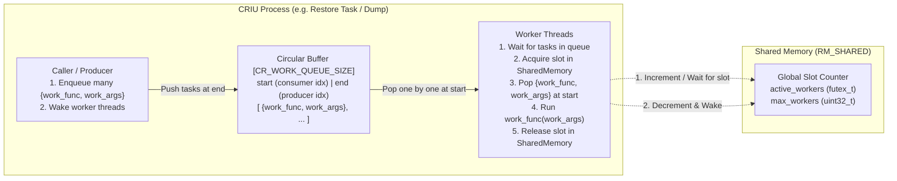

# Universal Parallel Task Engine for CRIU — Design Document

## 1. Overview & Motivation

CRIU needs a simple, reusable mechanism to run independent tasks in parallel across both **dump** and **restore** (e.g., page compression/decompression, image/page prefetching, and other CPU- or I/O-bound jobs).

During `restore`, CRIU forks multiple processes (one per restored process in the pstree). If each process independently spawns and runs worker threads up to the CPU count, the system will suffer from severe thread oversubscription ($O(\text{processes} \times \text{CPUs})$).

This design introduces a minimal, universal task engine built around two core primitives:
1. **A fixed-size circular buffer (ring buffer)** per task queue holding `{work_func, work_args}` entries with `start` and `end` indexes.
2. **A global concurrency counter in shared memory** initialized by the main CRIU process to cap the total number of concurrently executing worker threads across all CRIU processes.

---

## 2. Architecture & Data Structures



### 2.1. Work Item
Each element of the circular buffer is a lightweight descriptor with two fields:

```c
typedef int (*work_func_t)(void *arg);

struct cr_work {
	work_func_t work_func;
	void *work_args;
};
```

### 2.2. Global Shared Concurrency Control
Allocated once by the main CRIU process in shared memory (`shmalloc()` via `RM_SHARED`) before forking restore tasks:

```c
struct cr_work_budget {
	futex_t active_workers;      /* Current number of running workers (0 .. max_workers) */
	unsigned int max_workers;    /* Maximum allowed concurrent workers across all processes */
};
```

* **Initialization**: The main CRIU process initializes `active_workers = 0` and sets `max_workers` based on available CPUs (`sched_getaffinity`) and user configuration (e.g., `--jobs` / parallel thread limit).
* **Single-process mode (Dump)**: Uses the exact same structure (either allocated via `shmalloc` or a static instance in the main process).

### 2.3. Per-Process Task Queue (Circular Buffer)
Each process that wants to run parallel tasks initializes a local task queue (`struct cr_work_queue`). The producer can push many tasks into the circular buffer so worker threads stay continuously fed:

```c
#define CR_WORK_QUEUE_SIZE 256 /* Predefined fixed size (power of 2) */

struct cr_work_queue {
	struct cr_work buf[CR_WORK_QUEUE_SIZE];
	unsigned int start;          /* Consumer index (masked with CR_WORK_QUEUE_SIZE - 1) */
	unsigned int end;            /* Producer index (masked with CR_WORK_QUEUE_SIZE - 1) */

	pthread_mutex_t lock;        /* Protects start, end, inflight, worker counts, and stop */
	pthread_cond_t not_empty;    /* Signals sleeping worker threads when work is added */
	pthread_cond_t not_full;     /* Signals producer when circular buffer is full */
	pthread_cond_t empty_done;   /* Signals caller waiting for all queued tasks to complete */

	unsigned int inflight;       /* Number of tasks currently queued or executing */
	unsigned int idle_workers;   /* Number of spawned workers currently sleeping on not_empty */
	int error;                   /* Sticky error code if any work_func returns non-zero */
	bool stop;                   /* Set on queue teardown to exit worker threads */

	pthread_t *workers;          /* Dynamically grown / pre-allocated array up to max_workers */
	unsigned int nr_workers;     /* Number of lazily spawned worker threads in this process */
	struct cr_work_budget *budget; /* Pointer to shared memory counter */
};
```

---

## 3. Execution Protocol

### 3.1. Submitting Work & Lazy Worker Spawning (`cr_work_submit`)
The producer pushes tasks into the circular buffer without waiting on the global worker counter. It only waits if the local circular buffer (`CR_WORK_QUEUE_SIZE`) is full. Worker pthreads are spawned **lazily on-demand**:

1. Lock `q->lock`.
2. While `(q->end - q->start) == CR_WORK_QUEUE_SIZE` (buffer is full):
   - Wait on `q->not_full`.
3. Write `{work_func, work_args}` to `q->buf[q->end & (CR_WORK_QUEUE_SIZE - 1)]`.
4. Increment `q->end` and `q->inflight`.
5. **Wake or lazily spawn a worker**:
   - If `q->idle_workers > 0`:
     Signal an existing sleeping worker via `pthread_cond_signal(&q->not_empty)`.
   - Else if `q->nr_workers < q->budget->max_workers`:
     Spawn one new worker thread (`pthread_create(&q->workers[q->nr_workers++], ..., cr_worker_fn, q)`).
6. Unlock `q->lock`.

### 3.2. Acquiring and Releasing a Global Worker Slot
Anyone executing work in a worker thread must increment `budget->active_workers` if there is an available slot (`active_workers < max_workers`), or wait for a slot to become available:

```c
static void cr_work_acquire_slot(struct cr_work_budget *budget)
{
	while (1) {
		uint32_t cur = futex_get(&budget->active_workers);

		if (cur >= budget->max_workers) {
			/* Wait while active_workers == cur */
			futex_wait_while(&budget->active_workers, cur);
			continue;
		}

		if (atomic_cmpxchg(&budget->active_workers.raw, cur, cur + 1) == cur)
			return;
	}
}

static void cr_work_release_slot(struct cr_work_budget *budget)
{
	atomic_dec(&budget->active_workers.raw);
	futex_wake(&budget->active_workers);
}
```

### 3.3. Worker Thread Loop (`cr_worker_fn`)
Once a worker thread wakes up and acquires a global slot from shared memory, it **holds the global slot and drains tasks in a loop until the local queue is empty**, then releases the global slot:

1. Lock `q->lock`.
2. **Wait for work in local queue**:
   - Increment `q->idle_workers`.
   - Wait on `q->not_empty` while `q->start == q->end && !q->stop`.
   - Decrement `q->idle_workers`.
   - If `q->stop` and `q->start == q->end`, unlock `q->lock` and exit thread.
   - Unlock `q->lock`.
3. **Acquire global slot**:
   - Call `cr_work_acquire_slot(q->budget)` (increments shared counter if `< max_workers`, or waits for a free slot).
4. **Drain local circular buffer while holding the global slot**:
   - Lock `q->lock`.
   - While `q->start != q->end`:
     - Pop `item = q->buf[q->start & (CR_WORK_QUEUE_SIZE - 1)]` and increment `q->start`.
     - Signal `q->not_full` (in case producer was waiting on a full buffer) and unlock `q->lock`.
     - **Execute task**: `ret = item.work_func(item.work_args)`.
     - Lock `q->lock`.
     - If `ret != 0 && q->error == 0`, set `q->error = ret`.
     - Decrement `q->inflight`; if `q->inflight == 0`, broadcast `q->empty_done`.
   - Unlock `q->lock`.
5. **Release global slot**:
   - Call `cr_work_release_slot(q->budget)`.
   - Repeat from Step 1.

### 3.4. Waiting for Completion (`cr_work_wait`)
The caller thread typically queues a batch of tasks via `cr_work_submit()` and then calls `cr_work_wait(q)` to wait until all submitted tasks have completed:

1. Lock `q->lock`.
2. Help drain any remaining unstarted tasks in `q->buf[]` while `q->start != q->end` (ensuring forward progress even if all global worker slots are held by other processes).
3. Wait on `q->empty_done` while `q->inflight > 0` (waiting for active worker threads to finish their current tasks).
4. Read and reset `err = q->error; q->error = 0;`.
5. Unlock `q->lock` and return `err`.

---

## 4. Lifecycle & Process Fork Safety

In CRIU restore:
1. **Before forks (Main CRIU coordinator)**:
   - Allocates `struct cr_work_budget` via `shmalloc(sizeof(*budget))`.
   - Initializes `active_workers = 0` and `max_workers = nr_cpus`.
2. **In each process needing parallel workers (`cr-restore` task)**:
   - Initializes its local `struct cr_work_queue` (`cr_work_queue_init()`), which allocates zero pthreads upfront.
   - Worker threads are spawned lazily on-demand up to `min(tasks_submitted, max_workers)` as `cr_work_submit()` is called.
   - Worker threads block all asynchronous signals (`sigfillset` minus synchronous fault signals `SIGSEGV`, `SIGBUS`, `SIGABRT`, `SIGFPE`, `SIGILL`, `SIGTRAP`, `SIGSYS`) so CRIU's process-level `SIGCHLD`/signal handlers are never disturbed.
   - Destroys the local `cr_work_queue` (`cr_work_queue_destroy()`) before jumping into the restorer blob (`rst_mem_remap`) or before subsequent `fork()` calls.
